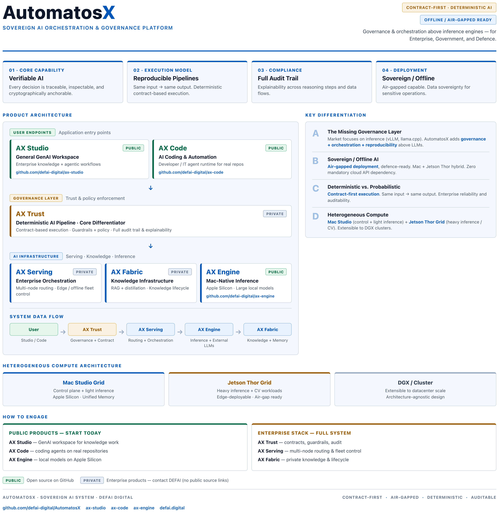

# AutomatosX

**Sovereign AI orchestration & governance platform**

AutomatosX sits **above inference engines**: application entry points, governance, and private AI infrastructure — for enterprise, government, and defence-grade operations.

This repository **introduces the AutomatosX system**. Product source and releases live in dedicated repositories.

---

## System overview

Open the interactive one-pager (architecture, products, data flow):

**→ [assets/AutomatosX_Infographic.html](assets/AutomatosX_Infographic.html)**



| | |
|---|---|
| **Interactive** | [AutomatosX_Infographic.html](assets/AutomatosX_Infographic.html) — open in a browser |
| **Static** | [AutomatosX_Infographic.png](assets/AutomatosX_Infographic.png) |
| **Positioning** | Contract-first · deterministic · offline / air-gapped ready |
| **Role of this repo** | System introduction and product map |

---

## Products

### Public (open source)

| Product | Role | Repository |
|---------|------|------------|
| **AX Studio** | General GenAI workspace — enterprise knowledge + agentic workflows | [defai-digital/ax-studio](https://github.com/defai-digital/ax-studio) |
| **AX Code** | AI coding & automation — developer / IT agent runtime | [defai-digital/ax-code](https://github.com/defai-digital/ax-code) |
| **AX Engine** | Mac-native inference — Apple Silicon optimized local models | [defai-digital/ax-engine](https://github.com/defai-digital/ax-engine) |

### Private (enterprise)

Part of the same system architecture — no public source links.

| Product | Role |
|---------|------|
| **AX Trust** | Deterministic AI pipeline — contracts, guardrails, audit, explainability |
| **AX Serving** | Enterprise orchestration — multi-node routing, heterogeneous compute |
| **AX Fabric** | Knowledge infrastructure — RAG, distillation, knowledge lifecycle |

Architecture, layers, and system data flow are in the [infographic](assets/AutomatosX_Infographic.html) above.

---

## Why AutomatosX

| Pillar | Meaning |
|--------|---------|
| **01 · Verifiable AI** | Decisions are traceable, inspectable, and anchorable |
| **02 · Reproducible pipelines** | Contract-based execution — same input → same output |
| **03 · Full audit trail** | Explainability across reasoning steps and data flows |
| **04 · Sovereign / offline** | Air-gapped capable — data sovereignty for sensitive ops |

- **Governance above LLMs** — not only inference (vLLM, llama.cpp, …); AutomatosX adds governance, orchestration, and reproducibility  
- **Sovereign / offline AI** — air-gapped paths; Mac + edge (e.g. Jetson Thor) hybrid designs  
- **Deterministic vs only probabilistic** — contract-first execution for reliability and audit  
- **Heterogeneous compute** — Mac Studio · Jetson Thor grid · extensible to DGX-class clusters  

---

## Documentation

| Doc | Contents |
|-----|----------|
| [docs/introduction.md](docs/introduction.md) | What AutomatosX is, who it is for |
| [docs/system.md](docs/system.md) | Full system architecture (layers + data flow) |
| [docs/products.md](docs/products.md) | Product directory (public + private) |
| [docs/getting-started.md](docs/getting-started.md) | Start with Studio, Code, or Engine |
| [docs/glossary.md](docs/glossary.md) | Terms |

---

## Quick start

### AX Studio — GenAI workspace

```text
https://github.com/defai-digital/ax-studio
```

Local-first desktop workspace: chat, providers, MCP tools, memory, optional local inference via AX Engine.

### AX Code — coding agents

```text
https://github.com/defai-digital/ax-code
```

Agent runtime for real repositories: TUI, CLI, SDK, sandboxing, sessions, MCP.

### AX Engine — local models on Apple Silicon

```text
https://github.com/defai-digital/ax-engine
```

Install, prepare models, serve OpenAI-compatible endpoints on Mac — then point Studio or Code at Engine.

---

## Organization

Built by **[DEFAI Digital](https://defai.digital)** · [github.com/defai-digital](https://github.com/defai-digital)

| | |
|---|---|
| Product | [automatosx.com](https://automatosx.com) |
| Company | [defai.digital](https://defai.digital) |
| System docs | This repository |

---

## Repository layout

```text
automatosx/
├── README.md                              # System introduction
├── assets/
│   ├── AutomatosX_Infographic.html        # Interactive system one-pager
│   └── AutomatosX_Infographic.png         # Static preview for GitHub
└── docs/                                  # Architecture & guides
```

---

## License

Documentation here is for system orientation. Each product repository carries its own license — check the product repo before installing or redistributing.
